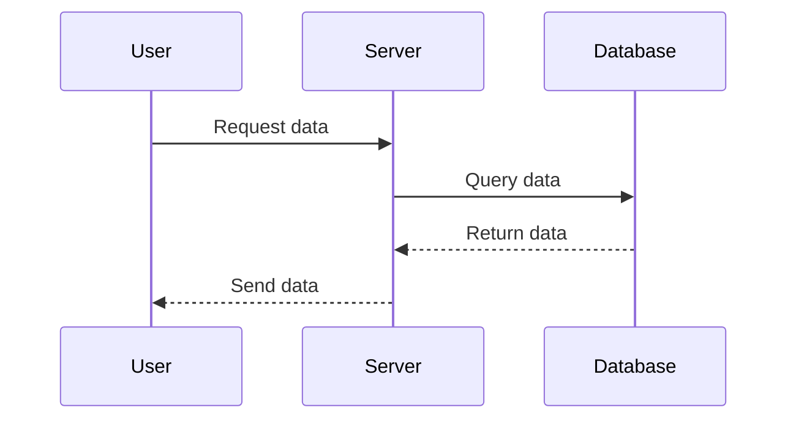
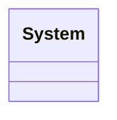

# Proyecto Sistemas Operativos

## Grupo:

### ***Erick Salazar Suarez***
### ***Andres Felipe Torres Monroy***
### ***Tomas Ramirez Roa***

## Comandos bash 
#### Todos los comandos empiezan con el programa make, que requiere de un archivo `Makefile/makefile`, el cual especifique los comandos `Bash` (Born Again Shell) a ser ejecutados.

#### Existen dos comandos que se tienen que sobreescribir o que vienen por defecto, `all` y `clear`, estos dos comandos especifican la creacion de todo el proyecto, y la eliminacion de algunos o todos los archivos generados por los comandos. A continuacion se describen estos dos comandos, y algunos otros agregados para la manipulacion eficiente del proyecto.

#### Banderas o variables de comandos
``` makefile
CEXE=gcc -std=c11 -o
CO=gcc -std=c11 -Wall -Werror -c
```

#### Comandos para creacion de archivos.o y sus dependencias o archivos necesarios para correr el comando
``` makefile
publisher.o: src/publisher/publisher.c
	@$(CO) src/publisher/publisher.c
	
suscriber.o: src/suscriber/suscriber.c
	@$(CO) src/suscriber/suscriber.c

system.o: src/system/system.c
	@$(CO) src/system/system.c
```

#### Comandos para los ejecutables del proyecto, con sus depencias de archivos .o
``` makefile 
publisher: publisher.o
    @$(CEXE) publisher publisher.o
    @alias publisher=./publisher
    @printf "\nEl archivo \"publisher\" ha sido creado\n"

suscriber: suscriber.o
    @$(CEXE) suscriber suscriber.o
    @alias suscriber=./suscriber
    @printf "\nEl archivo \"suscriber\" ha sido creado\n"

system: system.o
    @$(CEXE) system system.o
    @alias system=./system
    @printf "\nEl archivo \"system\" ha sido creado\n"
```

#### Sobreescritura de los comandos `all` y `clear`, con depencencias de archivos ejecutables para el comando `all` 
``` makefile 
all: publisher suscriber system 
    @printf "\nTodos los archivos ejecutables han sido creados con exito.\n"

clear:
    @rm *.o
    @rm publisher
    @rm system
    @rm suscriber
    @printf "\nArchivos eliminados\n"
```

#### Sobreescritura de los comandos `all` y `clear`, con depencencias de archivos ejecutables para el comando `all` 
``` makefile
rm_publisher:
    @rm publisher publisher.o
    @printf "\nEl archivo \"publisher\" y sus dependencias se han eliminado\n"

rm_suscriber:
    @rm suscriber suscriber.o
    @printf "\nEl archivo \"suscriber\" y sus dependencias se han eliminado\n"

rm_system:
    @rm system system.o
    @printf "\nEl archivo \"system\" y sus dependencias se han eliminado\n"
```

## Diagramas de Secuencia



## Sistema de comunicacion

### Descripcion:
lorem ipsum

### Diagrama de Clases



## Publicador

### Diagrama de Clases

## Suscriptor

### Diagrama de Clases

## Noticias/Topicos

### Diagrama de Clases
